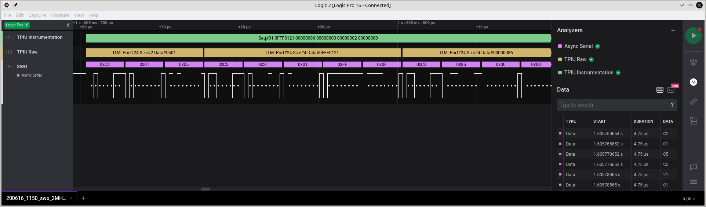
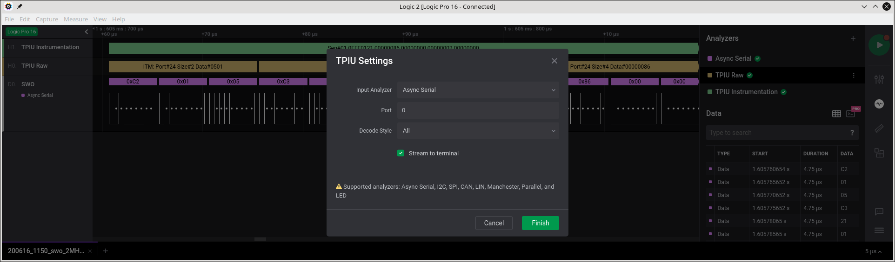
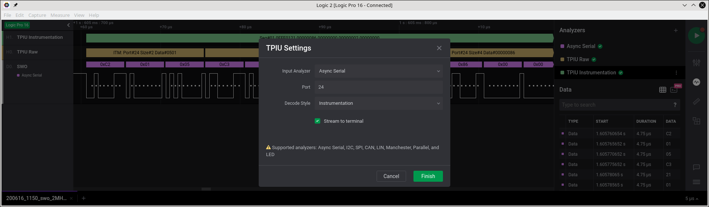

# ARM debug/trace extension

Simple ARM/Cortex debug/trace HLA extension for Saleae Logic2.

Since the Saleae HLA extension world does not allow for nesting of HLA
extensions on top of an existing extension (only on top of a base
supported analyser) this extension provides a `Decode Style` choice to
allow for some control over how and what parts of the TPIU ITM stream
are decoded.

This means the user can instantiate multiple copies of the extension
each showing specific aspects of the stream as required. The following
image is an example of two instances of the analyser being attached to
a 2MHz SWO capture. The yellow instance is a raw decode of the basic
TPIU packets. The green instance is decoding port 24 packets into
RTOS/application specific instrument records:

## Configuration

### `All`

When the `Decode Style` selected is `All` then the `Port` field is
**ignored** and can be any value. For example the following will
display raw decoding of all the TPIU packets:

### `Port`

When the `Decode Style` configured is `Port` then raw ITM packet
decode is provided for packets that match the configured trace port
number. All other packets are ignored.

### `Console`

When the `Decode Style` configured is `Console` then ITM packet decode
is provided for packets that match the configured trace port
number. All other packets are ignored. The contents of matching trace
port packets are treated as `ASCII`.

### `Instrumentation`

The `Instrumentation` style does basic decoding of generic
[eCosPro](https://www.ecoscentric.com/ecos/ecospro.shtml)
instrumentation records. The analyser currently only displays the raw
hexadecimal data, and does not yet decode the
class/type/etc. instrumentation information since we would need to
execute external tools to obtain the per-ELF-file (non-loaded)
description structures that define the individual record encoding for
the application being executed.

Similarly we would need to execute external tools to decode DWT
addresses to the original application source locations.

#### eCosPro instrumentation

The [eCosPro](https://www.ecoscentric.com/ecos/ecospro.shtml)
instrumentation consists of:

ITM packet size | Use    | Description
:---------------|:-------|:-----------
2-byte          | Header | Little-endian 0xNNSS where NN=number of fields : SS=sequence#
4-byte * NN     | Body   | 0 or more instrumentation record (structure) fields
1-byte          | Tail   | 0xSS where SS=sequence# should match the header sequence#

The use of fixed ITM packet sizes of 2 for the header, 1 for the tail
and ensuring instrumention records consist of a multiple (0..255)
number of 4-byte fields allows for synchronisation when the underlying
TPIU transport may "drop" packets. Processing tools can spot truncated
or dropped instrumentation records by matching the embedded header and
tail sequence numbers, and the header `NN` number of 4-byte fields
value.

The default transport for eCosPro instrumentation is traceport 24, but
can be configured to any arbitary port#. So when configuring the
analyser instance without access to the ELF descriptor sections the
user will need to match the analyser setting against the application
run-time.

ASIDE: An encoded full-timing recorded 5-word instrumentation record
takes ~150us to be transferred over an 8N1 2MHz UART (SWO) connection.
